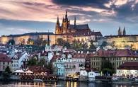

<html>
<head>
  <title>Franta Omáčka - Osobní web</title>
  
  
</head>
<body>
  

    <h1>Vítejte na mém osobním webu</h1>
    
  

  

    <a href="#about">Informace o sobě</a>
    <a href="#location">Informace o místě bydliště</a>
    <a href="#interests">Moje zájmy</a>
    <a href="#links">Odkazy</a>
    <a href="#contacts">Kontakty</a>
  

  

    <h2 id="about">Informace o sobě</h2>
    
Jsem Franta Omáčka, vymyšlená postava s bohatým životním příběhem. Rád cestuji po světě a objevuji nová místa. Baví mě sport, zejména fotbal a plavání. Miluji kreativitu a rád tvořím vlastní obsah, jako jsou malby a sochy. Jsem také nadšený kuchař a rád experimentuji s novými recepty.

    <h2 id="location">Informace o místě bydliště</h2>
    
Jsem hrdý obyvatel Prahy, krásného historického města s bohatou kulturou a zajímavou historií. V Praze rád trávím čas procházkami po Starém Městě a objevováním skrytých uliček.

    <h2 id="interests">Moje zájmy</h2>
    
Mými hlavními zájmy jsou cestování, sport, umění a kulinářství. Rád zkoumám nové destinace a poznávám různé kultury. Sport mě udržuje ve formě a nabíjí energií. Rád navštěvuji galerie a muzea a obdivuji různé formy umění. Kuchaření je pro mě způsob relaxace a kreativity.

    <h2 id="links">Odkazy</h2>
    <ul>
      <li><a href="http://www.example.com" target="_blank">www.example.com</a> - Ukázkový odkaz 1</li>
      <li><a href="http://www.samplelink.com" target="_blank">www.samplelink.com</a> - Ukázkový odkaz 2</li>
      <li><a href="http://www.demo.com" target="_blank">www.demo.com</a> - Ukázkový odkaz 3</li>
    </ul>
    <h2 id="contacts">Kontakty</h2>
    
Můžete mě kontaktovat na následujících adresách:

    <ul>
      <li>Email: franta.omacka@example.com</li>
      <li>Telefon: +420 123 456 789</li>
    </ul>
  

  

    
&copy; 2023 Franta Omáčka. Všechna práva vyhrazena. | Obrázky: 581D490E-74C6-4A99-94B9-5FB473F0DF7B.jpeg, 7511EF35-1D68-4C25-9FEA-A0E1ACC35929.jpeg, 8937CD4A-3536-4B49-BB95-79B06A7F44B2.jpeg

  

</body>
</html>

